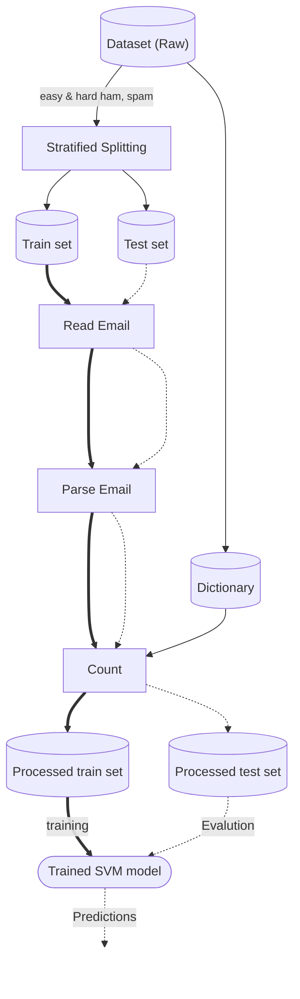

## Email classification using SVM

### Method 

Below is flowchart of the full pipeline 

<!-- 'themeVariables' : {'edgeLabelBackground' : 'transparent'}, -->


Bold Line : Train set workflow
Dashed line : Test set workflow


- **Read Email** : Reads the raw file 

- **Parse Email** : Extracts header, subject, count of numbers & symbols in mail to observe specific traits (like $ sign), links etc.

- **Count** : Prepares the final matrix with frequency of counts of words in subject,headers along with number,symbols and link count. Final features are large in number (length of dictionary plus 3-4 more for symbols, link etc..)

- **Dictionary** : list of all unique words present along all mails


### Model Selection

Because of very large number of features, SVM was selected as it excels in finding maximum-margin hyperlane in higher dimensions (By Cover's theorem)

### Further Details 

More Details are elaborated in the provided jupyter notebook

### For Recreation...

Just download following modules

```
pip install numpy pandas matplotlib scikit-learn beautifulsoup4 pystemmer
```

and run the notebook ...